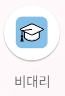
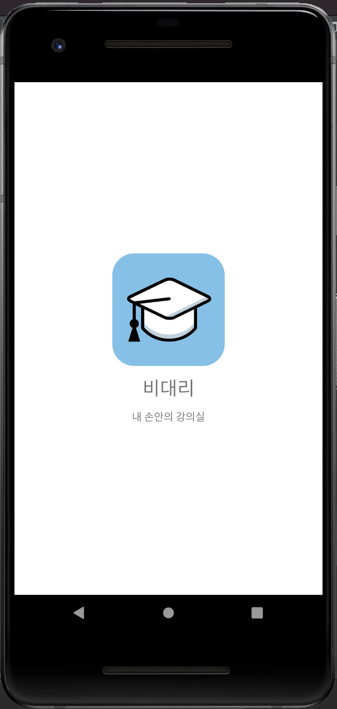

<h1 align="center">
   
  </a>
   
  비대리
  <h3 align="center"> 비대리 - 비대면 강의를 쉽고 체계적으로!</h3>
   
</h1>

## 사용 기술 및 라이브러리
- Android Studio 
- Kotlin
- lastAdapter - recyclerview adapter (https://github.com/nitrico/LastAdapter)
- Glide - image processing (https://github.com/bumptech/glide)
- Material Design - design theme, widgets (https://material.io)
- rxJava - reactivex programming (https://github.com/ReactiveX/RxJava)
- Jsoup - html web parser (https://jsoup.org)
- CircleProgress - circle indicator view (https://github.com/lzyzsd/CircleProgress)

## 주요 기능

- 강의를 온라인으로 수강할 수 있는 국민대학교 이캠퍼스 연동(http://ecampus.kookmin.ac.kr)
- <b>통합로그인</b> 지원
- <b>세션 유지</b> 지원 (로그인 세션 만료시까지 로그인 상태 유지)
- 앱 실행시마다 모든 정보는 <b>실시간 정보</b>임을 보장
- 강의별 <b>오늘 할 일</b> / <b>앞으로 해야할 일</b>을 한번에 볼수 있는 UI
- 오늘 할 일들은 시간이 되면 <b>자동으로 Notification(알림)</b> 보내줌
- 강의실을 통해 각 수강과목들의 출석률을 볼 수 있음

## 구현 내용

### 아이콘
</a>
- 커스텀 round 앱 아이콘

### 스플래쉬 화면
</a>
- 앱이 시작하면 보여짐
- 간단하게 앱 정보를 보여주는 스플래쉬 화면

### 로그인 화면
</a>
- 국민대학교 통합로그인 아이디와 비밀번호로 로그인 하는 폐이지
- Ecampus로부터 로그인 세션 토큰이 포함된 쿠키를 받아옴

</a>
- 만약 로그인 세션이 살아있다면 앱 재시작시 해당 페이지 자동으로 스킵함

### 홈 화면
</a>
- 처음으로 뜨는 화면
- 상단바에는 오늘의 날짜가 보여짐
- 오늘 할 일 그리고 예정된 할 일을 한번에 볼 수 있음
- 강의 타입(ZOOM 화상강의, 동영상 녹화강의, 과제, 파일)별로 직관적인 아이콘

</a>
- 예정된 할 일에서 같은 날짜에 할 일이 여러개라면 날짜를 중복해서 보여주지 않고 시간만 보여줌 (UI/UX 적 관점에서 직관성 증가)

</a>
- 할 일 클릭하면 해당 할 일로 손쉽게 이동

### 알림 서비스
</a>
- 오늘의 할일 강의나 과제 제출 마감 시간이 되면 자동으로 알림 전송
- 클릭하면 앱이 열려서 쉽게 할 일을 보고 열 수 있음
- 백그라운드 서비스로 동작하기 때문에 다른일을 하거나 잠금상태여도 알림 도착

### 강의실
</a>
- 현 학기에 수강중인 강의를 한눈에 볼 수 있음
- 클릭하면 해당 과목으로 손쉽게 이동
- 각 강의별로 출석률을 제공함. 단, 현재 통합인증 SSO 인증 업그레이드로 인하여 데이터 접근이 막힘 (추후 대응 예정)
